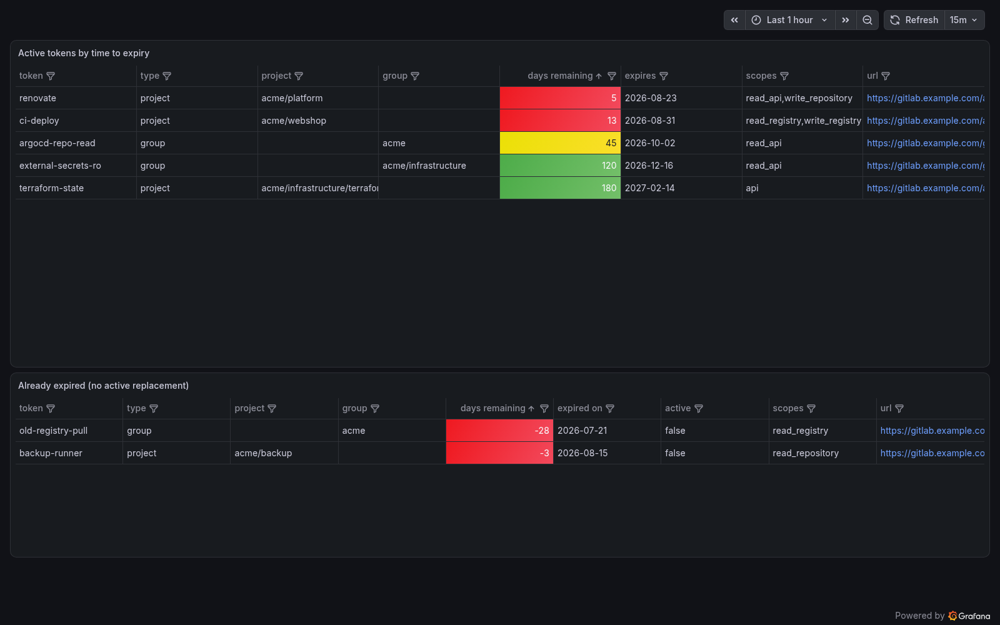

# gitlab-token-expiry-exporter

A Prometheus exporter that reports the expiry of **GitLab group and project access
tokens** as metrics — packaged as a Helm chart that ships ready-made **alert rules**
and a **Grafana dashboard**, so "a token silently expired and CI/ESO/renovate broke"
stops being a way you discover token expiry.

## What it does

Given one or more GitLab group paths, the exporter walks each group, its
subgroups and all their projects, lists every access token that has an expiry
date, and serves:

```text
gitlab_token_days_remaining{name="renovate", type="project", project="my-org/app",
  active="true", revoked="false", scopes="read_api", expires_at="2026-09-01", ...}  13
gitlab_tokens_exporter_scan_errors 0
gitlab_tokens_exporter_last_scan_timestamp 1755550000
```

The bundled `PrometheusRule` alerts on:

| Alert | Meaning |
|---|---|
| `GitLabTokenExpiringSoon` | an active token has fewer than `expiringSoonDays` days left |
| `GitLabTokenExpired` | a token expired and no active token with the same name replaced it |
| `GitLabTokensExporterScanErrors` | the last scan was partial (the previous complete result keeps being served) |
| `GitLabTokensExporterStale` | no fully successful scan for `staleAfterSeconds` |
| `GitLabTokensExporterAbsent` | the metric vanished entirely — expiry is unmonitored |

Design notes worth knowing:

- **A partial scan never erases data.** On scan errors the exporter keeps serving
  the last complete result and does not advance `last_scan_timestamp` — so firing
  alerts don't silently resolve, and the `Stale` alert catches the condition.
- GitLab flips `active=false` on the expiry date, which is why `ExpiringSoon` and
  `Expired` are two rules: the expired rule only fires when no same-named active
  replacement exists.
- The exporter is ~200 lines of stdlib-only Python. No dependencies to update.

## Install

The chart is released as an OCI package:

```sh
helm install tokens oci://ghcr.io/xcloud-eu/charts/gitlab-token-expiry-exporter \
  --set gitlab.url=https://gitlab.example.com \
  --set 'gitlab.groups={my-org}'
```

then put the GitLab token into the Secret the install NOTES name (see
[The token](#the-token) below).

## Dashboard



### The token

Create a **group access token** (or use a PAT of an owner) with the `read_api`
scope and the Owner role on each group listed in `gitlab.groups` — listing
access tokens requires owner. The token's reach also scopes the scan: a group
token only sees its own group tree.

Provide it one of three ways:

1. **Default — no values at all.** The chart references a Secret named after
   the release (`<release>-gitlab-token-expiry-exporter`, or just the release
   name if it contains the chart name; the install NOTES print the exact name)
   with key `GITLAB_READ_TOKEN`. Create that Secret however you manage secrets
   — external-secrets, sealed-secrets, `kubectl create secret` — and you're
   done. Until it exists the pod waits in `CreateContainerConfigError`.

2. **`gitlab.existingSecret`** — your Secret has a different name (and
   optionally `gitlab.existingSecretKey` for a different key):

   ```yaml
   gitlab:
     existingSecret: my-gitlab-token-secret
   ```

3. **`gitlab.token`** — the token inline in values, rendered into a
   chart-managed Secret. Quick starts only: anyone who can read your values
   (git, CI logs, `helm get values`) reads the token.

An example ExternalSecret pulling the token from a GitLab CI/CD variable is in
[examples/externalsecret.yaml](examples/externalsecret.yaml).

### Wiring into kube-prometheus-stack

The ServiceMonitor and PrometheusRule need labels matching your Prometheus
selectors:

```yaml
serviceMonitor:
  additionalLabels:
    release: kube-prometheus-stack
prometheusRule:
  additionalLabels:
    release: kube-prometheus-stack
```

The Grafana dashboard ships as a ConfigMap labelled for the grafana sidecar
(`dashboard.enabled`, on by default).

### Customising alerts

Every bundled alert can be switched off individually, and you can append your
own rules — they land in the same PrometheusRule:

```yaml
prometheusRule:
  rules:
    tokenExpired: false          # drop a bundled alert
  additionalRules:               # verbatim PrometheusRule rule syntax
    - alert: GitLabTokenExpiredCritical
      expr: gitlab_token_days_remaining{active="true"} < 3
      for: 15m
      labels:
        severity: critical
```

`prometheusRule.alertLabels` is stamped on every bundled alert (default
`severity: warning`); `additionalRules` carry only the labels you write on
them. Disabling all bundled rules with no additional ones is a template error
— set `prometheusRule.enabled: false` instead.

## Values

See [values.yaml](charts/gitlab-token-expiry-exporter/values.yaml) — every
knob is documented inline. The notable ones:

| Value | Default | |
|---|---|---|
| `gitlab.url` | `https://gitlab.com` | your GitLab instance |
| `gitlab.groups` | `[]` (required) | group paths to scan, subgroups included |
| `refreshHours` | `4` | scan interval |
| `image.tag` | the released version | the image built and tested with this chart release |
| `service.port` | `9184` | metrics port |
| `prometheusRule.expiringSoonDays` | `14` | warning threshold |
| `prometheusRule.alertLabels` | `severity: warning` | labels stamped on every bundled alert |
| `prometheusRule.rules.*` | all `true` | per-alert toggles for the bundled rules |
| `prometheusRule.additionalRules` | `[]` | your own rules, appended to the bundled group |
| `dashboard.folderAnnotation` / `folder` | unset | place the dashboard in a sidecar folder |

## Limitations

- **Group and project access tokens only.** Personal access tokens are not
  scanned — listing those instance-wide requires an admin token, a much bigger
  credential than this needs. Deploy tokens, OAuth tokens and CI job tokens are
  also out of scope. For PAT coverage, look at
  [cnieg/gitlab-tokens-exporter](https://github.com/cnieg/gitlab-tokens-exporter),
  whose subgroup-walking approach also informed this exporter.
- **Owner is required.** GitLab only lets Owners list access tokens, so the
  scan token needs the Owner role on every group in `gitlab.groups`.
- **Tokens without an expiry date are skipped.** Old tokens created before
  GitLab enforced expiry (pre-16.0) carry no `expires_at` and produce no
  metric — a non-expiring token is invisible here (it also can't "expire").
- **Replacement detection is by name.** `GitLabTokenExpired` treats an active
  token with the same name in the same project/group as the rotation of an
  expired one. Rotate under a new name and the old token keeps alerting until
  revoked.
- **It polls.** New or rotated tokens appear after the next scan
  (`refreshHours`, default 4h) plus a scrape interval — this is an expiry
  monitor with day granularity, not a real-time inventory.
- **One metric series per token.** Fine for hundreds or a few thousand tokens;
  scanning tens of thousands of projects sequentially will make scans slow and
  is untested territory.
- **Single replica.** After a pod restart the exporter serves 503 until its
  first scan completes (the readiness probe gates on this); state is
  in-memory. `GitLabTokensExporterAbsent` (1h) catches a scrape gap that
  actually matters.

## License

Apache-2.0 - Copyright 2026 [x-ion GmbH](https://www.x-ion.de/)
